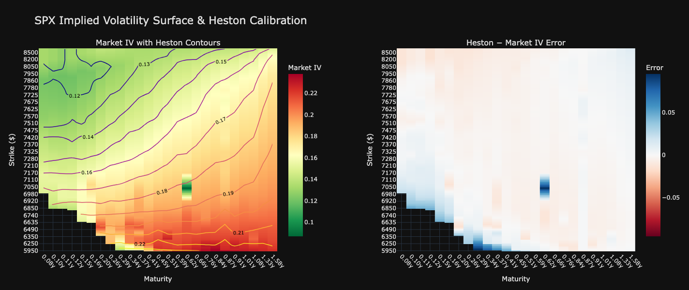

# HestonModel

A high-performance implementation of the Heston stochastic volatility model, built as a quantitative finance research project. The pricing engine is written in C++ and exposed to Python via pybind11, combining computational efficiency with a flexible Python interface for calibration and analysis.

---

## Overview

The Black-Scholes model assumes constant volatility, something never observed in real markets as evidenced by the presence of volatility smiles. The Heston model addresses this by making volatility stochastic, governed by a mean-reverting CIR process correlated with the underlying asset. This allows the model to reproduce the volatility smile and skew observed in options markets.

This project implements:

- **Heston Monte Carlo simulation**: Full path simulation of correlated stock price and variance processes, with multithreading via `std::thread`.
- **Carr-Madan FFT pricing**: Semi-analytical pricing via the Heston characteristic function and fast Fourier transform, significantly faster than Monte Carlo for vanilla options.
- **Calibration**: Fitting the five Heston parameters to real SPX options market data by minimising vega-weighted implied volatility residuals.
- **Volatility surface visualisation**: Comparison of the calibrated Heston implied volatility surface against market data

---

## Results

Calibration of parameters was performed on SPX options data with maturities ranging between 1 month and 2 years, using strikes within 80-120% of spot. The calibrated parameters at the time I ran the code were:

| Parameter | Value  | Description |
|-----------|--------|-------------|
| $v_0$ | 0.016  | Initial variance|
| $\rho$ | -0.64  | Correlation |
| $\kappa$ | 2.72   | Speed of mean reversion |
| $\theta$ | 0.0471 | Long-run variance  |
| $\xi$ | 0.6874 | Volatility of volatility |

The Heston model captures the overall volatility skew well, correctly pricing the negative correlation between returns and volatility but underestimates short-term implied volatility for deep OTM puts. This is a known limitation of the standard Heston model, which cannot simultaneously fit the short-term smile and term structure with constant parameters.

**Pricing performance:**

| Method                                               | Time    |
|------------------------------------------------------|---------|
| Monte Carlo (100k paths, 3 strikes, 1 maturity)      | ~7.68s  |
| Carr-Madan FFT (all strikes in the grid, 1 maturity) | ~0.036s |

<br>

**Accuracy when comparing against Black Scholes model:**

| Method                                               | Error   |
|------------------------------------------------------|---------|
| Monte Carlo (100k paths, 3 strikes, 1 maturity)      | ~0.28%  |
| Carr-Madan FFT (all strikes in the grid, 1 maturity) | ~0.056% |

---

## Volatility Surface



The left panel shows the market implied volatility surface as a heatmap, with the calibrated Heston implied volatility surface overlaid as contour lines. The colour gradient runs from green (low IV, high strikes) to red (high IV, low strikes), capturing the well-known negative volatility skew in SPX options. Lower strikes command higher implied volatilities due to the demand for downside protection.

The Heston contour lines broadly follow the colour boundaries, confirming the model captures the skew direction correctly. The contours are smoother than the market surface, which is expected. Heston produces a parametric surface that cannot replicate every local irregularity in market prices.

The right panel shows the pricing error (Heston IV minus Market IV) as a diverging heatmap centred at zero. Blue regions indicate where Heston overestimates implied volatility and red where it underestimates. Heston overestimates implied volatility at low strikes and short maturities, pricing the short-term downside skew as steeper than the market implies. This is a known limitation of the standard Heston model. The skew term structure decays too slowly at short maturities, a deficiency that motivates extensions such as the Bates model, which adds a jump component to better match the short-term smile.

---

## Dependencies

### System dependencies

**macOS:**
```bash
brew install cmake pkgconfig fftw
```

**Windows:** Install CMake from [cmake.org](https://cmake.org), then use vcpkg:
```bash
vcpkg install fftw3 pkgconf
```

---

## Building

```bash
git clone https://github.com/taskmaster0809/heston-fft-pricing.git
cd heston-fft-pricing
mkdir build && cd build
cmake ..
cmake --build .
```

The compiled Python module `heston.cpython-*.so` will be placed in `build/cpp/`.

### Python dependencies
```bash
pip install -r ../python/requirements.txt
```

`pybind11` is fetched automatically by CMake and does not need to be installed manually.

---

## Project Structure

```
HestonModel/
├── CMakeLists.txt
├── README.md
├── requirements.txt
├── cpp/
│   ├── CMakeLists.txt
│   ├── include/
│   │   ├── heston_mc.h
│   │   ├── heston_fft.h
│   │   └── utils.h
│   ├── src/
│   │   ├── heston_mc.cpp       # Monte Carlo pricer with multithreading
│   │   ├── heston_fft.cpp      # Carr-Madan FFT pricer
│   │   └── utils.cpp           # Black-Scholes analytical pricer
│   ├── bindings/
│   │   └── bindings.cpp        # pybind11 bindings
│   └── tests/
│       ├── test_mc.cpp         # Catch2 unit tests for MC pricer
│       ├── test_fft.cpp        # Catch2 unit tests for FFT pricer
│       └── CMakeLists.txt
├── python/
│   ├── data/
│   │   └── market_data.py      # SPX options data pipeline via yfinance
│   ├── calibration/
│   │   └── calibrate.py        # Heston parameter calibration
│   ├── analysis/
│   │   └── vol_surface.py      # Volatility surface visualisation
│   └── tests/
│       └── test_bindings.py    # Python binding validation tests
└── plots/
    └── vol_surface.png         # Market volatility heatmap and Heston contours

```

---

## Running Tests

```bash
cd build
ctest --output-on-failure
```

---

## Notes

- Options data is sourced from Yahoo Finance via `yfinance`. SPX data quality is generally good for liquid near-the-money options but may be unreliable for deep OTM/ITM contracts, where last traded price is used as a fallback when bid/ask spreads are unavailable.
- The risk-free rate is proxied by the US 13-week Treasury Bill yield (`^IRX`).
- Dividend yield is assumed to be zero. For SPY or QQQ, a continuous dividend yield adjustment would be required.
- The Feller condition $2\kappa\theta > \xi^2$ is not enforced during calibration. Calibrated parameters may violate it, which is consistent with findings in the empirical literature for equity indices.

---

## References

- Heston, S.L. (1993). *A Closed-Form Solution for Options with Stochastic Volatility*. Review of Financial Studies, 6(2), 327-343.
- Carr, P. and Madan, D. (1999). *Option Valuation Using the Fast Fourier Transform*. Journal of Computational Finance, 2(4), 61-73.
- Rouah, F.D. (2013). *The Heston Model and Its Extensions in Matlab and C++*. Wiley.
